# Outage Assessment — Big Picture

## 1. Purpose and components

A user runs Outage Assessment locally on their PowerFactory PC. The ComPython script calculates outage
scenarios and stores their results in SQLite. The dashboard shows these results as a summary with an
assessment per scenario and, on request, with signal charts. There is no login, no user management, no
footer and no date filter for the plots. Nothing needs administrator rights or an extra network port.

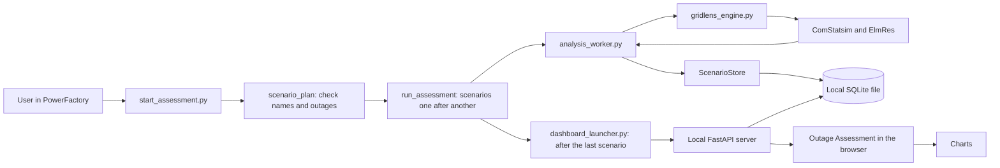

| File | Responsibility |
|---|---|
| `powerfactory/start_assessment.py` | database folder / name, scenario definitions, native calculation and dashboard start |
| `powerfactory/analysis_worker.py` | read the PF context, activate outages, run REF/OUTAGE, restore state, serialise complete series |
| `powerfactory/gridlens_engine.py` | taken-over GridLens helpers for native objects, QDS, ElmRes and restoration |
| `powerfactory/lodf.py` | LODF from DC load flows before the first simulation |
| `backend/app/simulation/store.py` | shared SQLite contract of PF and web app; jobs and atomic scenario import |
| `backend/app/simulation/across.py` | read-only aggregation: index, values per scenario (cached), profile |
| `backend/app/simulation/routes.py`, `data.py` | HTTP API on SQLite: series and analyses |
| `backend/app/main.py` | HTTP process, readiness, API and static frontend |
| `scripts/dashboard_launcher.py` | start a separate HTTP process for exactly the given database and open the browser |
| `scripts/serve.py`, `appconfig.py` | permanent server and shared configuration |
| `setup.ps1`, `setup.cmd` | one script from A to Z: Python, backend, Node, frontend build, configuration, self-test (no administrator rights) |
| `frontend/src/pages/DashboardPage.tsx` | selection of scenario / equipment / measurement and complete result series |
| `frontend/src/components/across/` | summary: key figures, assessment, profile, voltage, matrix, charts, radar, table, details |
| `frontend/src/hooks/useAcrossData.ts`, `util/acrossLoad.ts` | loading in parts: index first, then scenario by scenario |
| `frontend/src/util/outageAssessment.ts`, `config/assessment.ts` | cause, voltage band and verdict with criteria |
| `frontend/src/config/loadingBands.ts` | central loading bands and thresholds |
| `docs/ASSESSMENT.md` | definitions, criteria, API and customisation of the evaluation |
| `start-dashboard.command` | start the dashboard for an existing results database on the Mac |
| `backend/tests/qds_fixture.py` | synthetic test database, tests only (not in the package) |

## 2. Native execution in PowerFactory

`DATABASE_DIRECTORY` and `DATABASE_NAME` are configured in `start_assessment.py`. `SCENARIOS=None`
means: every eligible Planned Outage object with an overlapping QDS window forms one scenario under its
existing name. Outages that were ignored originally are activated explicitly for their own run. A
scenario can alternatively combine several outages under a custom name. With ambiguous object names,
full PF paths are used.

Start, end, step size, profiles and result variables are configured in the active `ComStatsim`. The
dashboard takes over this duration completely.

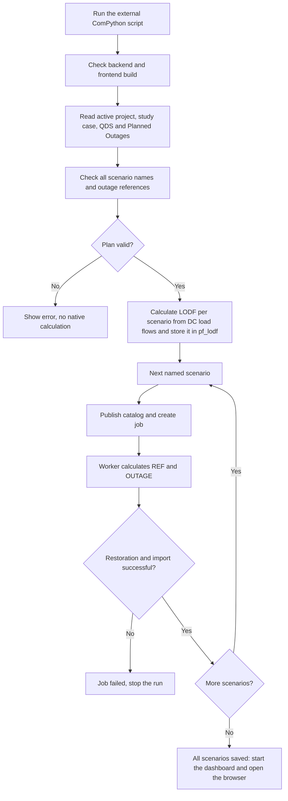

The LODF calculation runs once before the first simulation and restores every changed state, verified.
If it fails there is a warning; the scenarios run anyway.

Scenarios that were saved successfully are kept if a later calculation fails. Every new batch creates
new result runs with their own IDs; existing results are not overwritten. No `IntScenario` objects are
created: scenario name and outage combination belong to the persisted assessment result.

## 3. REF/OUTAGE and restoration

`calculate()` uses copied ElmRes objects with the existing variable selection. The interventions are
limited in time and are taken back with verification. In the native PF process the script needs only
the standard library and the PowerFactory module; FastAPI runs in its own Python process with the
backend environment.

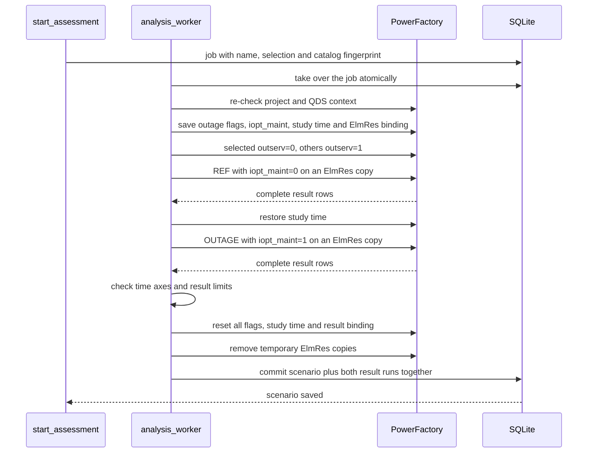

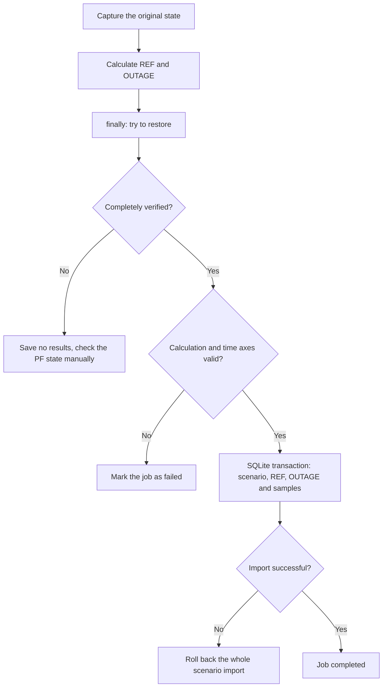

A job that is already running is not re-run automatically. After an abort of the PF process the native
state must be checked before that job is cleaned up explicitly.

## 4. Database model and identity

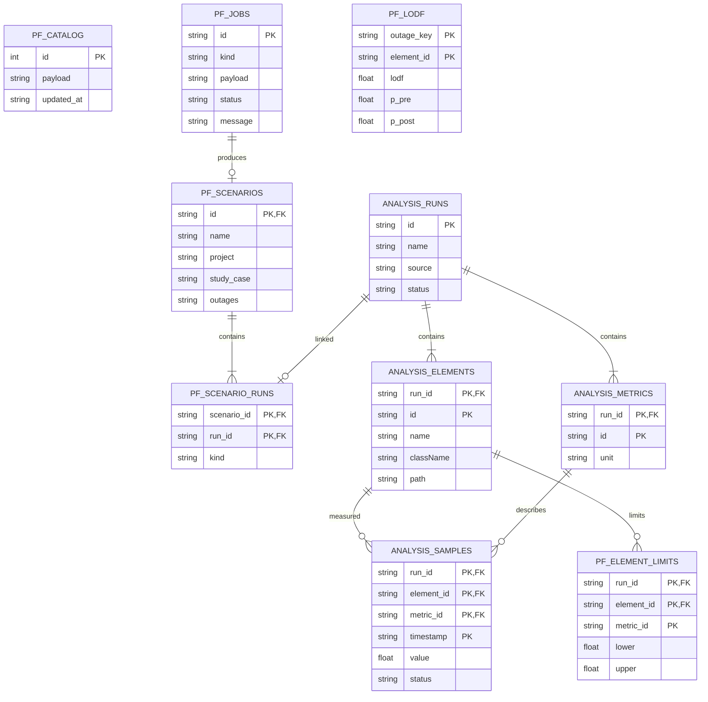

SQLite uses WAL and foreign keys. The element hash comes from project path and object path. The frontend
identifier additionally encodes the run ID, so the same equipment in REF and OUTAGE can be selected
separately. Chart legends contain scenario name, run kind and equipment. Renaming in PF changes the
path-based identity.

## 5. Dashboard and complete plots

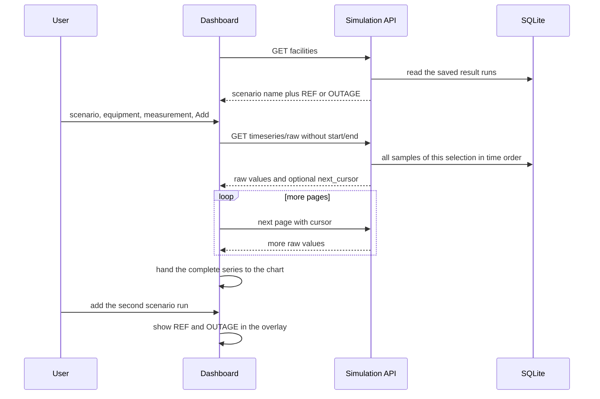

There is no hidden filter to the last 30 days and no dashboard period. Old simulations are shown
completely. Chart zoom is a view function. Additional aggregated charts are created only on explicit
choice. Missing or failed values are not invented as zeros. Oversize is reported with an error, not
silently cut off. The native ElmRes read-out limits a result to 35,040 rows; the simulation API accepts
up to 200,000 raw values per selection and pages with at most 50,000 values per page.

## 6. Evaluation across all scenarios

The summary is the standard view. It only reads and changes neither the calculation nor the results.
Details and definitions: [docs/ASSESSMENT.md](docs/ASSESSMENT.md).

### Loading in parts (large databases)

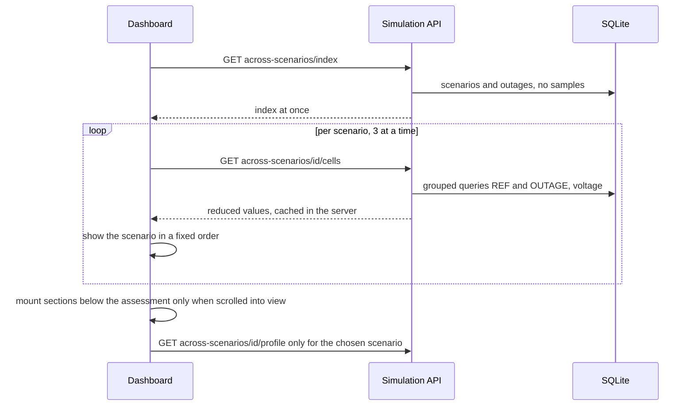

Saved scenarios never change; a refresh therefore loads only new ones. The codes S01, S02 … stay stable
because scenarios appear only as a prefix of the order.

### Verdict

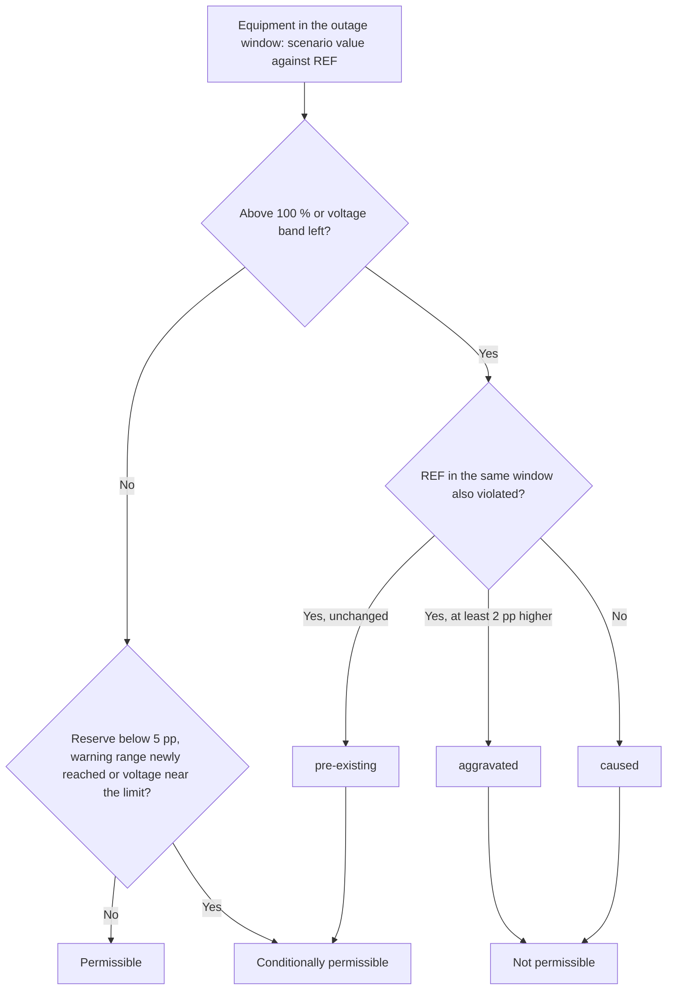

Lines and transformers are assessed by loading, busbars by voltage (band 0.90 to 1.10 p.u., configured
centrally). The verdict is a decision aid, not an approval; the criteria are in
`frontend/src/config/assessment.ts`.

### Reading order and text

Key figures, assessment, profile and scenario details, voltage, matrix, comparison charts and radar,
finally the detail table. A navigation bar follows this order. Explanations are off; the **i** on a card
or **Explanations** shows them. The time series overlay is an optional view under the summary.

## 7. Operation and dashboard process

Everything is on the PowerFactory PC: script, results database and dashboard server. Setup and
maintenance: [docs/DEPLOYMENT.md](docs/DEPLOYMENT.md).

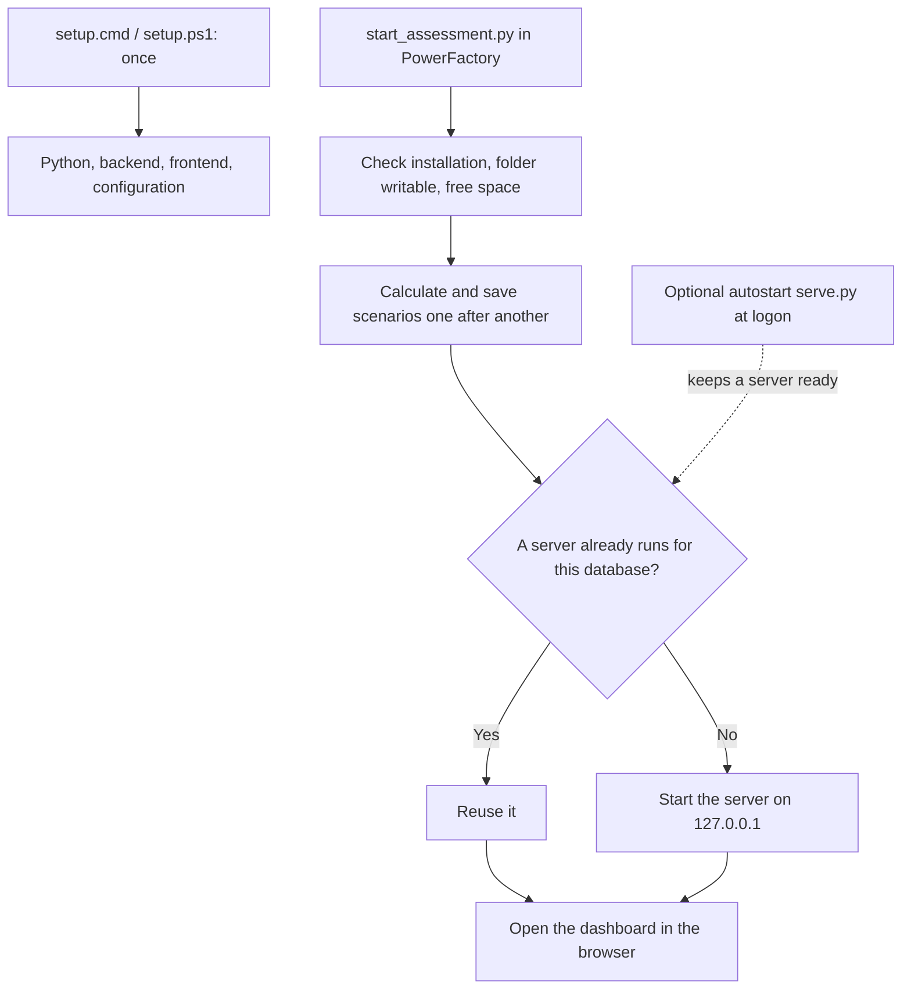

- **Configuration:** `scripts/appconfig.py` reads the environment, then `outage-assessment.config.json`,
  then the defaults. Script and autostart use the same file and thus the same database.
- **Server:** `scripts/dashboard_launcher.py` starts it from the script (fixed port 8765; if another
  server holds it, a free port with a note; a running server is reused; detached from the PowerFactory
  process). `scripts/serve.py` is the same server as a permanent process with a rotating log;
  `setup.ps1` sets up Python, the backend environment, the frontend build and the optional per-user
  autostart. It needs no administrator rights and creates no firewall rule.
- **Local by default:** the host is `127.0.0.1`. Only if an operator sets another host (and IT allows
  the port) does the backend run with `APP_ENV=production`: no database switching and protective
  headers. The dashboard has no login.
- **Database:** the script writes, the server reads, both on the same PC through SQLite with WAL. The
  file is never opened over a network share.
- **Dashboard after the calculation:** the script starts (or reuses) the server when the last scenario is saved
  and opens the browser. If the dashboard is already open (autostart), it also shows "PowerFactory is
  calculating: …" and loads new scenarios as soon as they are saved.
- **Package:** `scripts/package_release.py` builds a ZIP with backend, finished frontend, scripts,
  installer and docs, without databases, logs and local configuration.
- **Mac development:** `start-dashboard.command` binds only to `127.0.0.1` and keeps the terminal open.

## 8. Mac start with an existing database

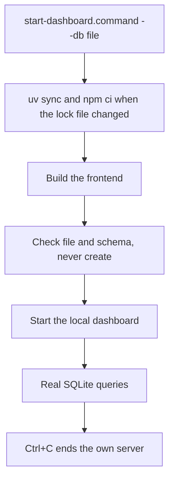

The real PF default is `backend/data/outage-assessment.sqlite3`. Synthetic data exists only as a test
fixture (`backend/tests/qds_fixture.py`) for backend tests and the browser smoke test.

## 9. Tests and real acceptance

### Switching the local database

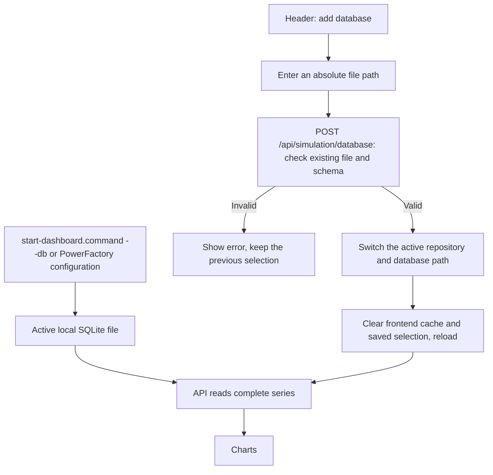

The path names a file on the machine of the server, with PowerFactory the PC itself. The selection
changes neither the stored measurements nor the start configuration. Old repository connections stay
available for running queries until the server ends. Switching is disabled when the server is exposed
to the network.

### Presentation and build

The light-mode variables and rules that apply only under `[data-grid-theme="light"]` in
`frontend/src/index.css` control the visual adaptation. The dark-mode and shared layout rules are
unchanged.

Vite loads charts dynamically. The ECharts libraries are distributed over Rolldown chunk groups with
`maxSize`; the warning threshold stays at 650 kB.

Worker tests use a native API replacement and check single outages, named combinations, batch
processing, state restoration and atomic persistence. The production smoke test starts the same
dashboard launcher with an isolated synthetic test database. Browser checks verify complete series even
with old timestamps, and the removed login, footer and date filter.

A real PowerFactory 2026 run on Windows remains necessary. In particular the mapping between ElmRes
timestamp, interval end and Planned Outage window that is still open in the GridLens project must be
checked technically. The application does not shift these timestamps automatically.
