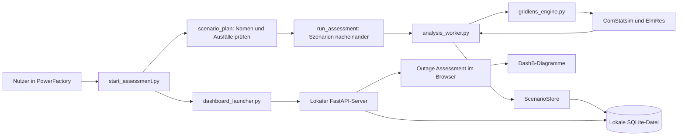
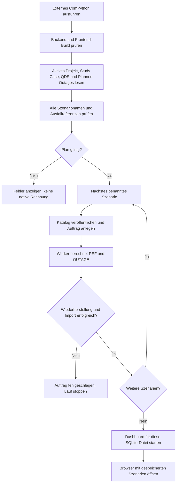
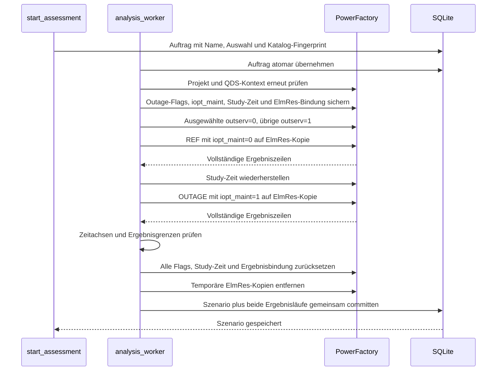
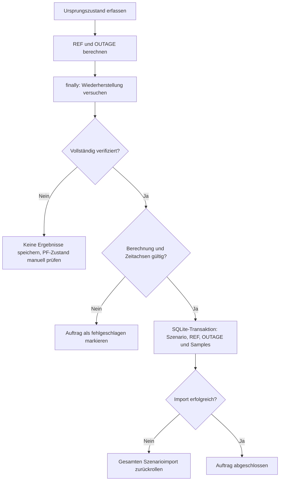
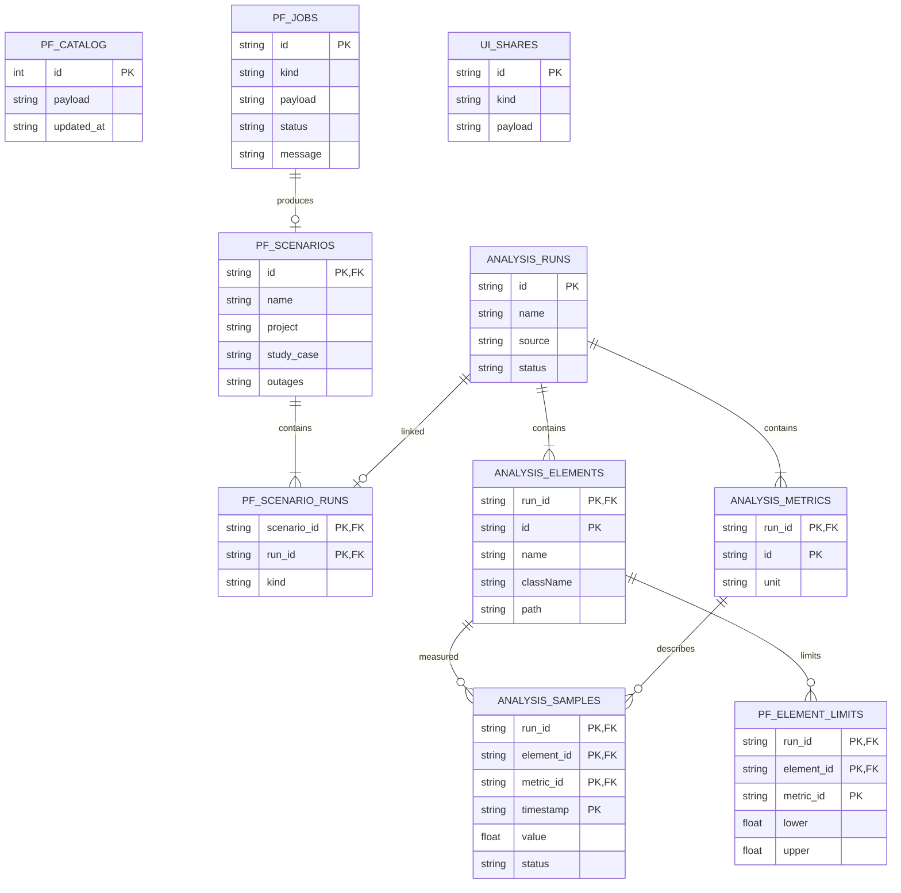
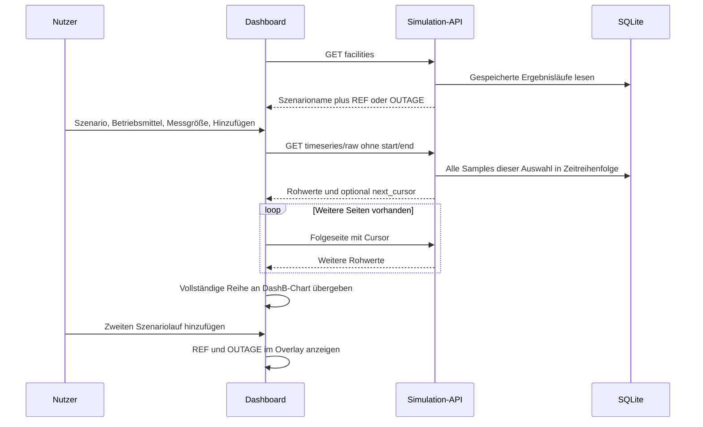
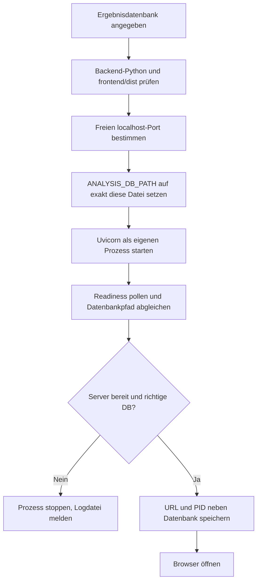
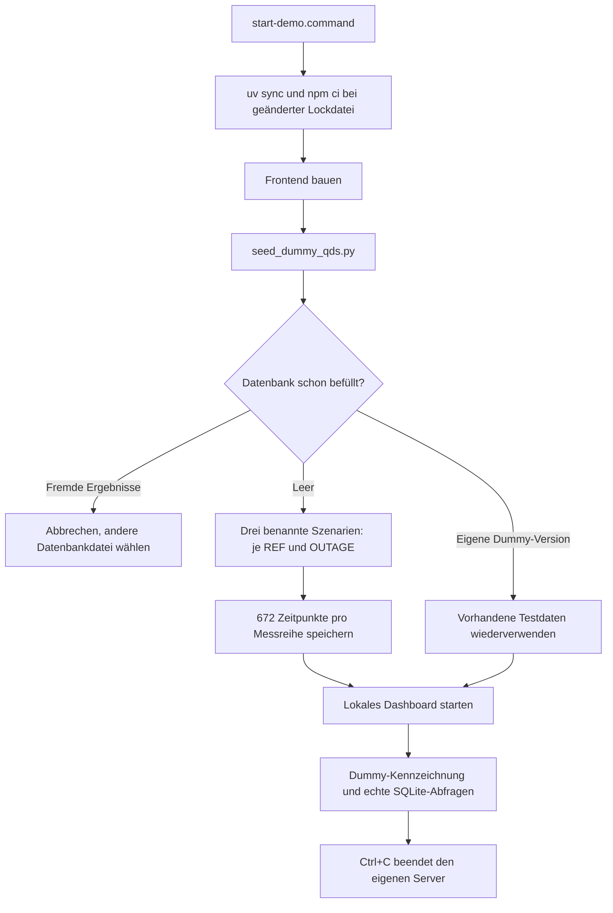

# Outage Assessment — Big Picture

## 1. Zweck und Komponenten

Ein Nutzer startet Outage Assessment lokal auf seiner PowerFactory-VM. Das
ComPython-Skript berechnet Freischaltszenarien und speichert ihre Ergebnisse in
SQLite. Das Dashboard zeigt diese Ergebnisse mit den übernommenen
DashB-Diagrammen. Es gibt keine Anmeldung, keine Benutzerverwaltung, keinen
Dashboard-Footer und keinen Datumsfilter für die Plots.

| Datei | Verantwortung |
|---|---|
| `powerfactory/start_assessment.py` | Datenbankordner/-name, Szenariodefinitionen, native Berechnung und Dashboard-Start |
| `powerfactory/analysis_worker.py` | PF-Kontext lesen, Ausfälle aktivieren, REF/OUTAGE ausführen, Zustand wiederherstellen, vollständige Reihen serialisieren |
| `powerfactory/gridlens_engine.py` | Übernommene GridLens-Helfer für native Objekte, QDS, ElmRes und Wiederherstellung |
| `backend/app/simulation/store.py` | Gemeinsamer SQLite-Vertrag für PF und Webapp; Aufträge und atomarer Szenarioimport |
| `scripts/dashboard_launcher.py` | Separaten HTTP-Prozess mit genau der angegebenen Datenbank starten und Browser öffnen |
| `backend/app/main.py` | HTTP-Prozess, Readiness, Simulation-API und statisches Frontend |
| `backend/app/simulation/routes.py` | DashB-API-Verträge auf SQLite abbilden |
| `backend/app/simulation/data.py` | Rohreihen, explizite Aggregation und Analysen |
| `frontend/src/pages/DashboardPage.tsx` | Auswahl von Szenario/Betriebsmittel/Messgröße und vollständige Ergebnisreihen |
| `frontend/src/components/OutageManagement.tsx` | Gespeicherte Szenarien und ihre Ausfallfenster erklären |
| `scripts/seed_dummy_qds.py` | Kleine synthetische QDS-Datenbank für Mac-Tests erzeugen |
| `start-demo.command` | Mac-Test per Doppelklick oder Terminal starten |

## 2. Native Ausführung in PowerFactory

In `start_assessment.py` werden `DATABASE_DIRECTORY` und `DATABASE_NAME`
konfiguriert. `SCENARIOS=None` bedeutet: jedes auswertbare Planned-Outage-Objekt
mit überlappendem QDS-Fenster bildet ein Szenario unter seinem vorhandenen Namen.
Auch ursprünglich ignorierte Ausfälle werden für ihren eigenen Lauf ausdrücklich
aktiviert. Ein Szenario kann alternativ mehrere Ausfälle unter einem eigenen
Namen kombinieren. Bei mehrdeutigen Objektnamen werden vollständige PF-Pfade benutzt.

Start, Ende, Schrittweite, Profile und Ergebnisvariablen werden im aktiven
`ComStatsim` konfiguriert. Das Dashboard übernimmt diese Dauer vollständig.

Bereits erfolgreich gespeicherte Szenarien bleiben erhalten, falls eine spätere
Berechnung fehlschlägt. Jeder erneute Batch erzeugt neue Ergebnisläufe mit eigenen
IDs; bestehende Ergebnisse werden nicht überschrieben. Es werden keine
`IntScenario`-Objekte erzeugt: Szenarioname und Ausfallkombination gehören zum
persistierten Assessment-Ergebnis.

## 3. REF/OUTAGE und Wiederherstellung

`calculate()` verwendet kopierte ElmRes-Objekte mit der vorhandenen
Variablenauswahl. Die Eingriffe sind zeitlich begrenzt und werden geprüft
zurückgenommen. Das Script benötigt im nativen PF-Prozess nur die
Standardbibliothek und das PowerFactory-Modul; FastAPI läuft in einem eigenen
Python-Prozess mit der Backend-Umgebung.

Ein bereits laufender Auftrag wird nicht automatisch erneut ausgeführt. Nach
Abbruch des PF-Prozesses ist der native Zustand zu prüfen, bevor der betreffende
Auftrag ausdrücklich bereinigt wird.

## 4. Datenbankmodell und Identität

SQLite verwendet WAL und Fremdschlüssel. Der Element-Hash stammt aus Projektpfad
und Objektpfad. Die Frontend-Kennung kodiert zusätzlich die Lauf-ID: dasselbe
Betriebsmittel in REF und OUTAGE lässt sich dadurch getrennt auswählen. Diagramm-
legenden enthalten Szenarioname, Laufart und Betriebsmittel. Umbenennungen in PF
ändern die pfadbasierte Identität.

## 5. Dashboard und vollständige Plots

Es gibt keinen versteckten Filter auf die letzten 30 Tage und keinen
Dashboard-Zeitraum. Alte Simulationen werden ebenfalls vollständig angezeigt.
Chart-Zoom ist eine Ansichtsfunktion. Zusätzliche aggregierte Diagramme werden
nur auf ausdrückliche Auswahl erzeugt. Fehlende/fehlgeschlagene Werte werden
nicht als Nullen erfunden. Übergröße wird mit einem Fehler gemeldet, nicht still
abgeschnitten. Die native ElmRes-Auslese begrenzt ein Resultat auf 35.040 Zeilen;
die Simulation-API akzeptiert bis 200.000 Rohwerte je Auswahl und paginiert
mit maximal 50.000 Werten je Seite.

## 6. Dashboard-Prozess starten

Der HTTP-Prozess bindet an `127.0.0.1`. Der Standardport `0` bedeutet automatische
Portwahl. Neben der Datenbank entstehen `<name>.dashboard.log` und
`<name>.dashboard.json` mit URL und PID. Der native Dashboard-Prozess läuft nach
Ende des ComPython-Skripts weiter. Er kann über seine PID beendet werden. Der
Mac-Starter hält dagegen sein Terminal offen und beendet seinen Server bei Ctrl+C.

## 7. Mac-Test ohne PowerFactory

Die Testdaten enthalten Leitungen, einen Transformator, Sammelschienen,
Auslastungen, Spannungen sowie P/Q/Strom. Ausfallbedingte Unterschiede entstehen
nur in den jeweiligen Dummy-Ausfallfenstern. Sie sind synthetisch und werden als
`Dummy QDS (synthetic)` gespeichert. Standarddatei:
`backend/data/outage-assessment-demo.sqlite3`. Der echte PF-Standard verwendet
`backend/data/outage-assessment.sqlite3`.

## 8. Tests und reale Abnahme

Worker-Tests verwenden eine native API-Nachbildung und prüfen einzelne Ausfälle,
benannte Kombinationen, Batch-Verarbeitung, Zustandswiederherstellung und atomare
Persistenz. Der Produktions-Smoke startet den gleichen Dashboard-Launcher mit
isolierter Dummy-Datenbank. Browserprüfungen kontrollieren vollständige Reihen
auch mit alten Zeitstempeln sowie die entfernte Anmeldung, den Footer und den
Datumsfilter.

Ein echter PowerFactory-2026-Lauf auf Windows bleibt erforderlich. Insbesondere
muss die im GridLens-Projekt offene Zuordnung zwischen ElmRes-Zeitstempel,
Intervallende und Planned-Outage-Fenster fachlich geprüft werden. Die Anwendung
verschiebt diese Zeitstempel nicht automatisch.
