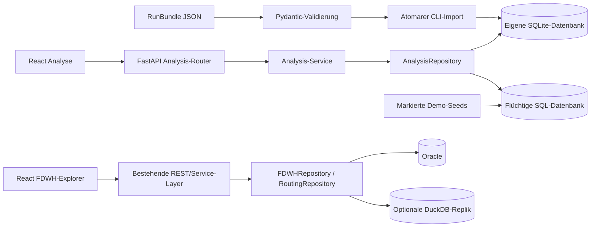

# Architektur und Datenregeln

## Neues Modell

`analysis_runs`: ID, Name, Projekt, Study Case, Quelle, Status.
`analysis_elements`: Run-Snapshot mit stabiler Element-ID, Name, Klasse, Typ, Pfad.
`analysis_metrics`: pro Run ID, Bezeichnung, Einheit und optionale untere/obere Grenze.
`analysis_samples`: Run, Element-ID, Messgröße, UTC-Zeit, nullable Wert, Ergebnisstatus.
Zusammengesetzte Primär-/Fremdschlüssel und ein Zeitfensterindex schützen die Zuordnung.
`schema_migrations` dokumentiert Version 1. Migration liegt paketierbar unter
`backend/app/analysis/migrations/001_analysis.sql` und ist wiederholbar ohne Datenverlust.

Die eigene SQLite-Datei ist unabhängig von Oracle und der optionalen DuckDB-Replik.
Repository-Schnittstelle: runs/run, elements, metrics, samples und atomarer import_bundle.
Spätere SQL-Systeme oder Importquellen können diese Schicht ersetzen, ohne UI-Komponenten
auf PowerFactory-Details umzustellen.

## Filter und Mathematik

`GET /api/analysis/query`: run_id, metric_id, compare_run_id, element_type, search,
wiederholbares element_ids, start und end. Die Oberfläche bietet eine Einzelauswahl;
die API akzeptiert mehrere IDs. Grenzen sind inklusive. Zeitzonenlose Simulationszeiten
werden abgelehnt; Offset-Zeitstempel werden nach UTC normalisiert.

- Null/fehlgeschlagene Messwerte werden nicht als Nullzahl verrechnet.
- count: Anzahl gültiger Werte. missing: gespeicherte Null-/failed-Werte; nicht die Zahl
  hypothetisch erwarteter, aber überhaupt nicht importierter Messungen.
- Mittelwert/Minimum/Maximum/Populationsstandardabweichung über alle gültigen Einzelmesswerte.
- P95: linear interpoliertes empirisches Perzentil.
- Zeitlinie: Mittelwert pro Zeitpunkt über die ausgewählten Elemente; keine physikalisch
  irreführende Summe von Leitungs-/Trafoleistungen. Anzahl beitragender Werte ist in der API enthalten.
- Verletzung: strikt kleiner als lower oder größer als upper; Gleichheit ist erlaubt.
  Es werden Messwertverletzungen gezählt, keine zusammenhängenden Störungsereignisse.
- Histogramm: 12 gleich breite Klassen, Dauerlinie: explizit 101 empirische Quantile.
  Bei unregelmäßigen Zeitabständen ist die Dauerlinie keine zeitgewichtete Aussage.
- Vergleich: gleiche Projektbezeichnung, Messgrößen-ID und Einheit. Mittelwertdelta wird
  ausschließlich aus Paaren mit identischer Element-ID und UTC-Zeit gebildet.
  Keine Zuordnung über Anzeigenamen, keine implizite Zeitverschiebung.
- CSV: identische Filterpopulation, originale Einzelwerte und vollständige Elementidentität;
  Excel-Formelpräfixe in Textfeldern werden entschärft. Fehlende/failed-Werte bleiben sichtbar.
- Diagrammzoom verändert ausschließlich den sichtbaren Chartausschnitt; globale Filter steuern KPIs.

Abfragegrenzen: maximal 500 ausgewählte Elemente, 100.000 Messpunkte und 10.000 Zeitpunkte.
Größere Abfragen erhalten eine explizite Fehlermeldung; keine unbemerkte Verdichtung.
Importgrenzen: 100 MB Datei, 250.000 Samples, 10.000 Elemente, 100 Messgrößen pro Bundle.
Für größere produktive Datenmengen sind Batchimport und SQL-seitige Aggregation nächste Schritte.

## Auth und Betrieb

Demomodus: ausschließlich synthetische Daten ohne Login; in Produktion verboten.
Persistenzmodus: JWT-Pflicht. `AUTH_BACKEND=oracle` erhält den vorhandenen Login;
`AUTH_BACKEND=local` bietet ein konfiguriertes Einzelkonto mit scrypt-Hash und Constant-Time-Vergleich.
Keine HTTP-Schreib-/Import-Endpunkte. Das CLI benötigt lokal autorisierten Dateizugriff.
Produktionskonfiguration benötigt einen expliziten JWT-Schlüssel; Entwicklung erzeugt bei fehlendem
Schlüssel einen flüchtigen Zufallswert. Sessions bleiben im Browser-SessionStorage.

API-Fehler enthalten Request-IDs; vorhandene Logging-/Rate-Limit-/CORS-/Security-Strukturen
bleiben erhalten. Der statische Fallback prüft Pfadcontainment und liefert unter `/api/*`
keine irreführende HTML-Antwort aus. SQL-Verbindungsfehler werden nach außen nicht offengelegt.

Alle SQLite-Lese-/Schreibzugriffe sind pro Prozess geschützt; Imports erfolgen transaktional.
Mehrere Prozesse sehen dieselbe Dateidatenbank, Demomodus hat je Prozess dieselben deterministischen Seeds.
Der vorhandene Analytics-Cache sowie Rate-Limits sind pro Prozess, nicht verteilt.
