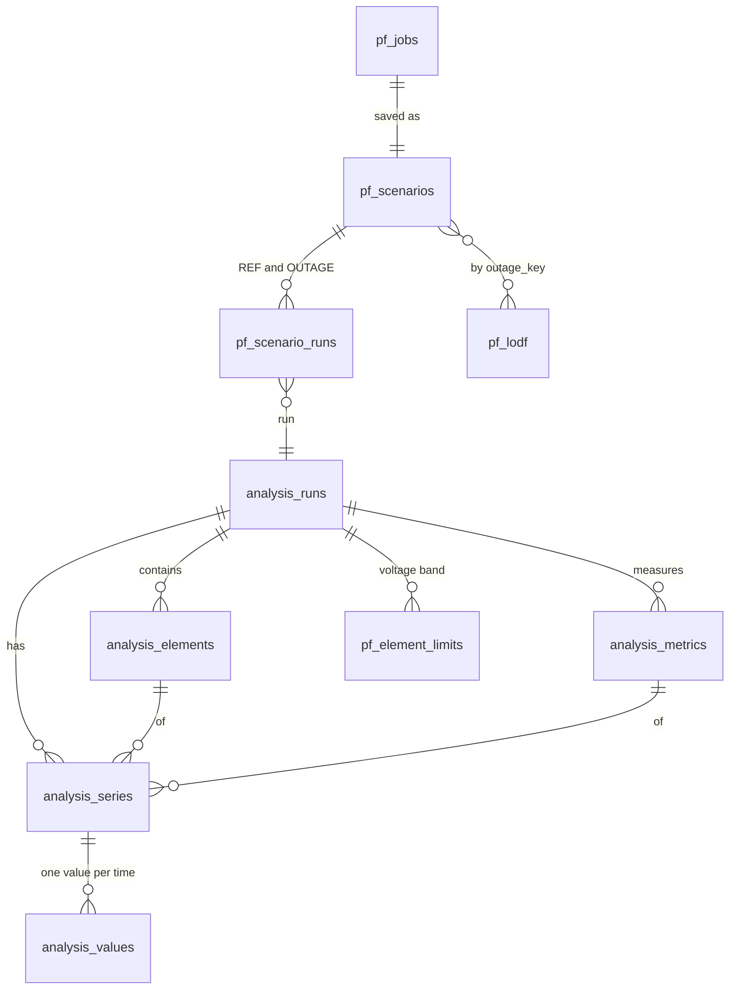

# Results database

All results live in **one SQLite file** (default `backend\data\outage-assessment.sqlite3`, configured in
`outage-assessment.config.json`). The PowerFactory script is the only writer; the dashboard and any
external tool only read. The file uses SQLite's WAL mode, so reading never blocks the script and the
script never blocks a reader.

Schema version: **2** (table `schema_migrations`). The schema is defined in
`backend/app/analysis/migrations/002_analysis.sql` (results) and `backend/app/simulation/store.py`
(PowerFactory bridge and views).

## Overview



A **scenario** is one named planned-outage case. It has two **runs**: `REF` (every planned outage
disabled) and `OUTAGE` (its planned outages enabled). All scenarios of one calculation share the same
REF run: it is stored once and linked to each of them.

## Tables

### Results

| Table | One row per | Columns |
|---|---|---|
| `analysis_runs` | run | `id`, `name`, `project`, `study_case`, `source`, `status` |
| `analysis_elements` | element of a run | `run_id`, `id`, `name`, `className` (ElmLne, ElmTr2, ElmTerm …), `type` (line, transformer, bus), `path` (full PowerFactory path) |
| `analysis_metrics` | measured quantity of a run | `run_id`, `id` (loading, voltage …), `name`, `unit`, `lower`, `upper` |
| `analysis_series` | time series: run × metric × element | `id` (integer), `run_id`, `metric_id`, `element_id` |
| `analysis_values` | value of a series at one time | `series_id`, `t` (epoch seconds, UTC), `value` (`NULL` = no valid value, e.g. a de-energised busbar) |

### PowerFactory bridge

| Table | Content |
|---|---|
| `pf_catalog` | one row: project, Study Case, simulated period and every planned outage (JSON) as seen by the last run |
| `pf_jobs` | calculation requests and their outcome (`completed`, `failed`, message) |
| `pf_scenarios` | saved scenarios: `id`, `name`, project, Study Case, `outages` (JSON list of outage ids), `created_at` |
| `pf_scenario_runs` | `scenario_id`, `run_id`, `kind` (`REF` / `OUTAGE`) |
| `pf_scenario_provenance` | per scenario: PowerFactory version, project and Study Case paths, operational scenario, grids, QDS command (JSON) |
| `pf_element_limits` | voltage band per busbar and run: `lower`, `upper` |
| `pf_run_notes` | only for a run that is not `completed`: `status` (`not_converged`: the calculation ended with an error code and the results stop there; `incomplete`: time points without any value) and the explanation `note` |
| `pf_lodf` | `outage_key`, `element_id`, `lodf` (signed fraction at the bus1 side, from PowerFactory), `p_pre`, `p_post` (always NULL: PowerFactory's tool gives no flows), `computed_at` |
| `pf_progress` | one row: what the script is doing right now (`state` running / finished / failed / stopped, `step`, `detail`, `current` of `total` scenarios, `started_at`, `updated_at`); the dashboard shows it as a banner while the script calculates |
| `pf_lodf_undefined` | `outage_key`, `reason`: outages whose LODF is not defined (no contingency, no solution, no equipment), see [ASSESSMENT.md](ASSESSMENT.md) |

### Identifiers

| Identifier | Built from | Stable across |
|---|---|---|
| element `id` | SHA-256 of `<project path>|<element path>` | all runs and calculations of one project |
| outage id | SHA-256 of the planned outage's PowerFactory path | all calculations |
| `outage_key` | the sorted outage ids of a scenario, comma-separated | scenarios with the same outages |
| run `id` | `<job id>-OUTAGE`, `reference-<random>` for the shared REF | – |

The grid (ElmNet) of an element is the folder name before `.ElmNet` in its `path`
(`…\D7 Grid.ElmNet\L1.ElmLne` → `D7 Grid`); the views below provide it as the column `grid`.

## Why it is built this way

Almost all of the file is `analysis_values`: about 455 series × 8,760 hours × 21 runs ≈ 84 million
values for a year. Each value is therefore stored as three numbers only, in key order:

- `analysis_series` gives every series a short integer key; the long text identifiers (run, metric,
  64-character element hash) are stored once per series instead of once per value.
- Times are epoch seconds (an integer), not text.
- `analysis_values` is a `WITHOUT ROWID` table: the table *is* its key order, so one series is one
  contiguous range on disk and no second copy of the key exists.

Measured with 7.1 million values (455 series × 744 hours × 21 runs):

| | schema 1 | schema 2 |
|---|---|---|
| file size | 3,069 MB (430 bytes per value) | **179 MB (25 bytes per value)** |
| scenario list / equipment dropdown | 1,000 ms (read every stored value) | **< 1 ms** |
| loading statistics of one run (core of the key figures) | 95 ms | **48 ms** |
| one time series (SQL) | 0.26 ms | 0.20 ms |
| saving one scenario (338,000 values) | – | 0.44 s |
| dashboard request while the script saves | waited for the write lock (up to 30 s) | **answers at once** |

Opening the file never writes: the schema is set up once per file (tracked in `PRAGMA user_version`).

## Reading the results with other tools

The file can be read while the dashboard runs. Open it **read-only**, never write to it by hand.

### Views

| View | One row per | Use |
|---|---|---|
| `v_scenarios` | scenario | name, outages, the ids of its REF and OUTAGE run |
| `v_planned_outages` | planned outage of the last run | name, equipment, window in UTC, whether it lies in the simulated period |
| `v_elements` | element of a run | name, class, type, grid, path |
| `v_series` | time series | run, metric, unit, element, grid |
| `v_runs` | calculated run | run, `case_kind`, `status` (`completed`, `not_converged`, `incomplete`), `note`, number of linked scenarios (0: a REF saved before its scenarios) |
| `v_samples` | value | scenario (NULL for a REF no scenario links to yet), `case_kind` (REF/OUTAGE), element, grid, metric, unit, `timestamp_utc`, `epoch`, `value` |
| `v_lodf` | LODF value | scenario, element, grid, `lodf`, `p_pre`, `p_post` |
| `v_lodf_undefined` | scenario without LODF | scenario, reason |

Filter `v_samples` at least by scenario and element (or metric); it holds every value of the file.

### Examples (SQL)

```sql
-- all scenarios with their outages
SELECT scenario, outage_ids, created_at FROM v_scenarios ORDER BY created_at;

-- REF and OUTAGE loading of one line in one scenario
SELECT case_kind, timestamp_utc, value FROM v_samples
WHERE scenario = 'NE_L1' AND element = 'Line A' AND metric = 'loading'
ORDER BY timestamp_utc, case_kind;

-- highest loading per element of one grid in one scenario
SELECT element, MAX(value) AS max_loading FROM v_samples
WHERE scenario = 'NE_L1' AND case_kind = 'OUTAGE' AND grid = 'D7 Grid' AND metric = 'loading'
GROUP BY element ORDER BY max_loading DESC LIMIT 10;

-- the largest |LODF| per scenario
SELECT scenario, element, lodf FROM v_lodf l
WHERE abs(lodf) = (SELECT MAX(abs(lodf)) FROM v_lodf WHERE scenario = l.scenario);
```

### Python (pandas)

```python
import sqlite3, pandas as pd
db = sqlite3.connect("file:C:/LocalData/outageAssessment/backend/data/outage-assessment.sqlite3?mode=ro", uri=True)
df = pd.read_sql("SELECT case_kind, timestamp_utc, value FROM v_samples "
                 "WHERE scenario=? AND element=? AND metric='loading'", db, params=("NE_L1", "Line A"))
```

### sqlite3 command line, DB Browser for SQLite

`sqlite3 -readonly outage-assessment.sqlite3` or the portable *DB Browser for SQLite* (open with
"Read Only"). Both run without installation rights. Excel and Power BI need an SQLite ODBC driver,
which usually has to be installed by IT; the Python route above writes a CSV for Excel without one
(`df.to_csv("result.csv", index=False)`).

## Backup

Copying the file while the dashboard runs is not safe (WAL). Use
`sqlite3 outage-assessment.sqlite3 ".backup backup.sqlite3"`, or stop the dashboard first
(`stop-dashboard.cmd`) and copy the file.

## Rebuilding

The results can always be calculated again from PowerFactory, so the file is never migrated:

- A file written by an earlier schema version is refused with a clear message, by the PowerFactory
  script before it calculates anything and by the dashboard.
- To start over: `stop-dashboard.cmd -DeleteDatabase` (stops the dashboard, then deletes the file after
  a confirmation), then run `start_assessment.py` in PowerFactory. It creates a new, empty file.
- When the schema changes, `SCHEMA_VERSION` in `backend/app/analysis/schema.py` is raised together
  with the schema file; views and bridge tables are versioned by `LAYOUT_VERSION` in
  `backend/app/simulation/store.py` and are brought up to date automatically when a file is opened.
