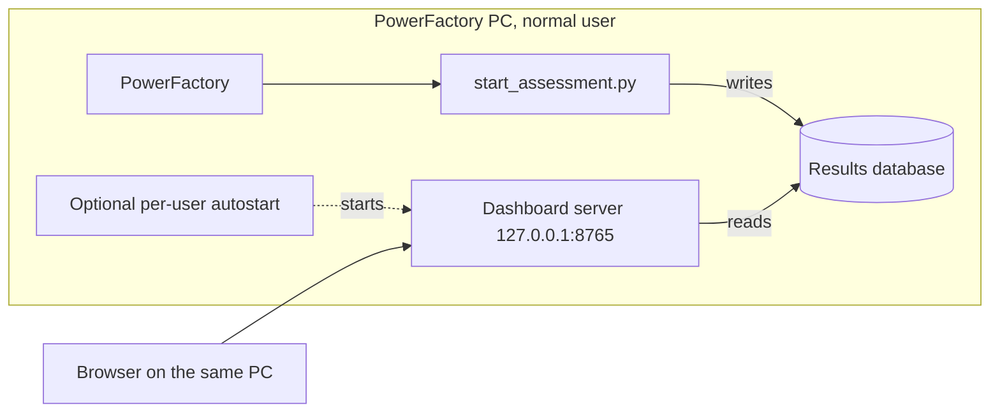

# Operation on the PowerFactory PC

PowerFactory, the script and the results database are on **one** PC. The dashboard server runs there,
next to the database, and listens on `127.0.0.1` on a single port. Nothing outside the project
folder is changed: **no administrator rights, no firewall rule, no service, no extra port.** Nothing
is copied or synchronised, and the SQLite file is never opened over a network share (SQLite does not
tolerate that reliably).



## One-time setup (on the PowerFactory PC)

1. **Copy the project** (or unpack the release package) to the PC, for example to `C:\OutageAssessment`.
   A release package is built with `.\setup.ps1 -Package` and already contains the finished frontend.
2. **Python is optional:** `setup.ps1` uses Python 3.12+ if it finds it; otherwise it downloads the portable
   `uv` into `.tools\` and lets it install Python for the current user.
3. **Run the setup** by double-clicking `setup.cmd`, or in a normal PowerShell (not as administrator):

   ```powershell
   cd C:\OutageAssessment
   powershell -ExecutionPolicy Bypass -File setup.ps1 -Autostart -Database D:\OutageAssessment\outages.sqlite3
   ```

   The script creates the Python environment in `backend\.venv`, builds the frontend if `frontend\dist` is
   missing (it uses Node 22.13+ or downloads a portable Node into `.tools\`), writes
   `outage-assessment.config.json`, optionally registers the per-user task and tests the server. Run it again at
   any time; finished steps are skipped.
   Every step is reported in detail (what was found, what was decided and why, each command with its output,
   exit code and duration, and a summary at the end). The complete output is also kept in `.tools\setup.log`;
   if a step fails, the message names the step and the call stack.
   Without internet access use `-Wheelhouse <folder>` (build the package with
   `python scripts/package_release.py --wheelhouse`). `-Autostart` is optional: without it the
   PowerFactory script starts the dashboard itself, and
   `backend\.venv\Scripts\python.exe scripts\serve.py` starts it by hand.
4. **In PowerFactory** create an external ComPython script that points to
   `C:\OutageAssessment\powerfactory\start_assessment.py`. Set `SCENARIOS` at the top if needed
   (default: one scenario per Planned Outage in the QDS period).

## Daily use

- **Calculate:** activate project and study case, run the script. It checks folder and free space, creates the
  database, **starts the dashboard right away** (or reuses a running one) and opens `http://127.0.0.1:8765`, then
  calculates the scenarios one after another and saves each one at once.
- **View while it calculates:** the dashboard reads while the script writes (SQLite WAL). A banner at the top of
  the Outage Management page names the current step and scenario with a progress bar; every finished scenario
  appears within a few seconds, without reloading. When the script fails or is stopped, the banner says so and the
  scenarios saved so far stay.
- **Later:** the dashboard stays available with all saved results, also when PowerFactory is closed
  (with autostart; otherwise run the script again or start `serve.py`).

## Settings

`outage-assessment.config.json` in the project folder (template:
`outage-assessment.config.example.json`):

| Key | Meaning | Default |
|---|---|---|
| `database` | path of the results database | `backend\data\outage-assessment.sqlite3` |
| `host` | `127.0.0.1` = this PC only | `127.0.0.1` |
| `port` | port of the dashboard | `8765` |

The environment variables `OA_DATABASE`, `OA_HOST`, `OA_PORT` take precedence. The same file applies
to the PowerShell script, the PowerFactory script and the autostart, so all use the same database.

### Optional: other PCs

Other PCs can reach the dashboard only if the server listens beyond the local PC. That is deliberately
not set up by the installer, because it needs a Windows Firewall permission (administrator rights).
If your IT department allows it, set `"host": "0.0.0.0"` and let IT open the port for the internal
subnet. The server then runs read-only (see "Security"). Never forward the port to the internet.

## Operation and maintenance

| Task | How |
|---|---|
| Check status | `Invoke-RestMethod http://127.0.0.1:8765/api/health/ready` |
| Restart the server | `Stop-ScheduledTask OutageAssessmentDashboard; Start-ScheduledTask OutageAssessmentDashboard` |
| Logs | next to the database: `<name>.server.log` (autostart) and `<name>.dashboard.log` (started by the script), rotated at 5 MB |
| Backup | copying the database while the server runs is not safe (WAL). Better `sqlite3 results.sqlite3 ".backup backup.sqlite3"` or stop the server briefly |
| Read the results elsewhere | read-only views for Excel, Power BI and Python: [DATABASE.md](DATABASE.md) |
| Update | unpack the new release package over the folder (configuration and database stay), run `setup.ps1` again, restart the task. If the new version reports "written by an earlier version", delete the database with `stop-dashboard.cmd -DeleteDatabase` and calculate again (see [DATABASE.md](DATABASE.md)) |
| Stop the dashboard, release the database | double-click `stop-dashboard.cmd`: stops the autostart task, a Windows service of the same name and every server process of this folder, then checks that the database is free. `-DisableAutostart` keeps the task from starting again at logon; `-DeleteDatabase` deletes the database afterwards (asks first); `-DryRun` only shows what it would stop |
| Remove | `deploy\windows\uninstall.ps1` (removes the task; the database stays) |

## Troubleshooting

| Observation | Cause and remedy |
|---|---|
| Script stops with "The files of this installation are from different versions", or a PowerFactory error like "too many values to unpack", "has no attribute" or "cannot import" | files of different releases were mixed (typical after copying single files, or with two copies of the project on the PC). The message names the files and their paths; replace the complete folders `powerfactory\` and `backend\app\` with the ones of one release, for example with `git pull` |
| Warning "Dashboard not started: Backend is missing" or "Frontend build is missing" | the calculation still runs; only the dashboard is skipped. The message names the missing file. `frontend\dist` is not in git: run `setup.ps1 -RebuildFrontend` in this copy of the project, or use the complete release package |
| Script reports "not writable" or "not enough free space" | check the database folder; at least 2 GB free |
| Note "Port is in use" | another process uses the port; change `port` in the configuration |
| Message "read-only" or 403 | intended in network mode: nobody can switch the database |
| The database cannot be deleted or replaced | a dashboard server still has it open; run `stop-dashboard.cmd` (with autostart the task would otherwise start the server again) |
| Server stops after logoff | without autostart the server started by the script is tied to the PowerFactory process; use `-Autostart` |

## Security

- The dashboard has **no login**. By default it is reachable on this PC only.
- When the host is not `127.0.0.1` the backend runs with `APP_ENV=production`: no database switching
  and protective headers. The API has no write endpoints for visitors.
- If a login is needed, put a reverse proxy with authentication in front and keep `host` at
  `127.0.0.1`.

## Not verified on the real environment

The flows are verified with tests and real server processes on macOS. On the PowerFactory PC please
confirm once: the Windows installer (only checked syntactically), that the server started by the
script survives the PowerFactory process (otherwise use autostart), and the LODF: the script creates the Contingency Analysis
`Outage Assessment` with one contingency per scenario (and the command *Sensitivities / Distribution Factors* if the
Study Case has none) through `CreateObject` / `ComOutage.SetObjs`; this is checked only against a fake, never against a
real PowerFactory (see `docs/ASSESSMENT.md`).
