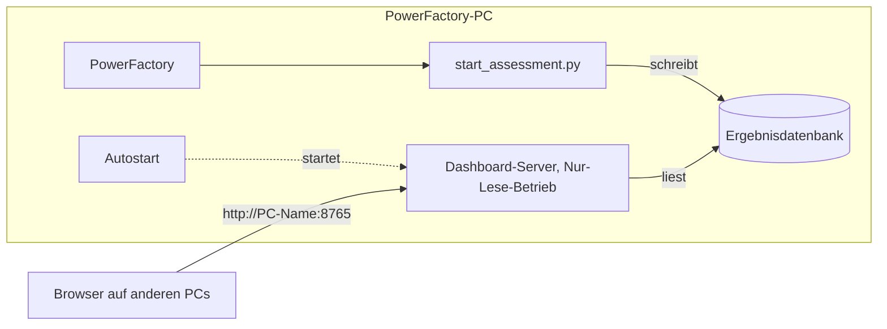

# Produktiver Betrieb

PowerFactory, das Skript und die Ergebnisdatenbank liegen auf **einem** PC (dem PowerFactory-PC).
Der Dashboard-Server läuft dort neben der Datenbank und ist im Netz erreichbar; auf anderen PCs
genügt ein Browser. Es wird nichts kopiert oder synchronisiert, und die SQLite-Datei wird nicht über
eine Netzfreigabe geöffnet (SQLite verträgt das nicht zuverlässig).



## Einmal einrichten (auf dem PowerFactory-PC)

1. **Release-Paket entpacken**, z. B. nach `C:\OutageAssessment`
   (erstellt auf einem Entwicklungsrechner mit `python scripts/package_release.py`).
2. **Python 3.12 oder neuer** installieren (python.org, „Add python.exe to PATH“ anhaken).
3. **PowerShell als Administrator** öffnen und ausführen:

   ```powershell
   cd C:\OutageAssessment
   powershell -ExecutionPolicy Bypass -File deploy\windows\install.ps1 -Database D:\OutageAssessment\freischaltungen.sqlite3
   ```

   Das Skript legt die Python-Umgebung an, schreibt `outage-assessment.config.json`, öffnet den Port
   **nur für das lokale Netz**, richtet den Autostart ein und testet den Server. Am Ende stehen die
   Adressen für andere PCs. Ohne Internet: `-Wheelhouse <Ordner>` (Paket mit
   `python scripts/package_release.py --wheelhouse` erstellen).
4. **In PowerFactory** ein externes ComPython-Skript anlegen und auf
   `C:\OutageAssessment\powerfactory\start_assessment.py` verweisen. Bei Bedarf oben `SCENARIOS`
   setzen (Standard: ein Szenario je Planned Outage im QDS-Zeitraum).

## Täglicher Ablauf

- **PowerFactory-PC:** Projekt und Study Case aktivieren, das Skript ausführen. Fertig.
  Es prüft Speicher und Ordner, nutzt den laufenden Dashboard-Server (oder startet einen), berechnet
  die Szenarien nacheinander und speichert jedes sofort.
- **Andere PCs:** `http://<PC-Name>:8765` im Browser öffnen. Neue Szenarien erscheinen von selbst;
  oben steht, was PowerFactory gerade berechnet.
- **Später:** Das Dashboard bleibt mit allen gespeicherten Ergebnissen erreichbar, auch wenn
  PowerFactory geschlossen ist.

## Einstellungen

`outage-assessment.config.json` im Programmordner (Vorlage: `outage-assessment.config.example.json`):

| Schlüssel | Bedeutung | Standard |
|---|---|---|
| `database` | Pfad der Ergebnisdatenbank | `backend\data\outage-assessment.sqlite3` |
| `host` | `0.0.0.0` im Netz erreichbar, `127.0.0.1` nur dieser PC | `0.0.0.0` |
| `port` | Port des Dashboards | `8765` |

Umgebungsvariablen `OA_DATABASE`, `OA_HOST`, `OA_PORT` haben Vorrang. Dieselbe Datei gilt für das
Skript in PowerFactory und für den Autostart, beide arbeiten also mit derselben Datenbank.

## Betrieb und Wartung

| Aufgabe | Wie |
|---|---|
| Status prüfen | `Invoke-RestMethod http://localhost:8765/api/health/ready` |
| Server neu starten | `Stop-ScheduledTask OutageAssessmentDashboard; Start-ScheduledTask OutageAssessmentDashboard` |
| Logs | neben der Datenbank: `<name>.server.log` (Autostart) und `<name>.dashboard.log` (vom Skript gestartet), werden bei 5 MB rotiert |
| Sicherung | Datenbank bei laufendem Server kopieren ist nicht sicher (WAL). Besser `sqlite3 ergebnisse.sqlite3 ".backup sicherung.sqlite3"` oder den Server kurz anhalten |
| Aktualisieren | neues Release-Paket über den Ordner entpacken (Konfiguration und Datenbank bleiben), `install.ps1` erneut ausführen, Aufgabe neu starten |
| Entfernen | `deploy\windows\uninstall.ps1` (Datenbank bleibt) |

## Fehlersuche

| Beobachtung | Ursache und Abhilfe |
|---|---|
| Skript meldet „Backend fehlt“ oder „Frontend-Build fehlt“ | `install.ps1` ausführen bzw. vollständiges Release-Paket verwenden |
| Skript meldet „nicht beschreibbar“ oder „zu wenig Speicher“ | Datenbankordner prüfen; mindestens 2 GB frei |
| Anderer PC erreicht das Dashboard nicht | Server läuft? (`Status prüfen`), Firewall-Regel vorhanden (`Get-NetFirewallRule -DisplayName "Outage Assessment Dashboard"`), beide PCs im selben Subnetz, Netzwerkprofil „Privat“ oder „Domäne“ |
| Hinweis „Port belegt“ | anderer Prozess nutzt den Port; `port` in der Konfiguration ändern |
| Meldung „Nur-Lese-Betrieb“ bzw. 403 | gewollt: im Netz kann niemand etwas ändern oder die Datenbank wechseln |
| Server stoppt nach Abmelden | Autostart eingerichtet? Ohne ihn hängt der vom Skript gestartete Server am PowerFactory-Prozess |

## Sicherheit

- Das Dashboard hat **keine Anmeldung** und ist für das **interne Netz** gedacht. Die Firewall-Regel
  erlaubt nur das lokale Subnetz; den Port **nie** ins Internet weiterleiten.
- Im Netz ist es schreibgeschützt: kein Wechsel der Datenbank, keine Aufträge, kein Speichern von
  Ansichten. Rückgabe sind nur Ergebnisse, keine Dateien beliebiger Pfade.
- Wer zusätzlich eine Anmeldung braucht, schaltet einen Reverse-Proxy mit Authentifizierung davor und
  setzt `host` auf `127.0.0.1`.

## Nicht auf der echten Umgebung geprüft

Die Abläufe sind mit Tests und echten Serverprozessen auf macOS geprüft. Auf dem PowerFactory-PC
ist einmal zu bestätigen: der Windows-Installer (nur syntaktisch geprüft), dass der vom Skript
gestartete Server den PowerFactory-Prozess überlebt (sonst Autostart nutzen), das Verhalten der
Firewall im Firmennetz und die LODF-Variablen (siehe `docs/ASSESSMENT.md`).
