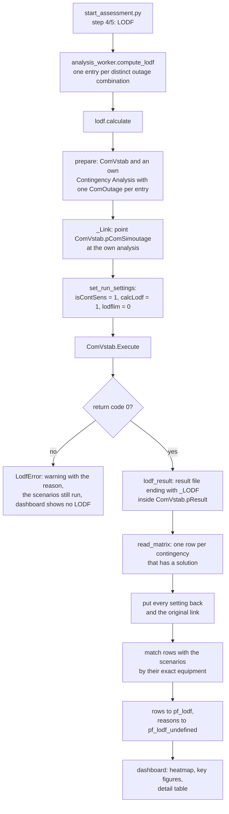
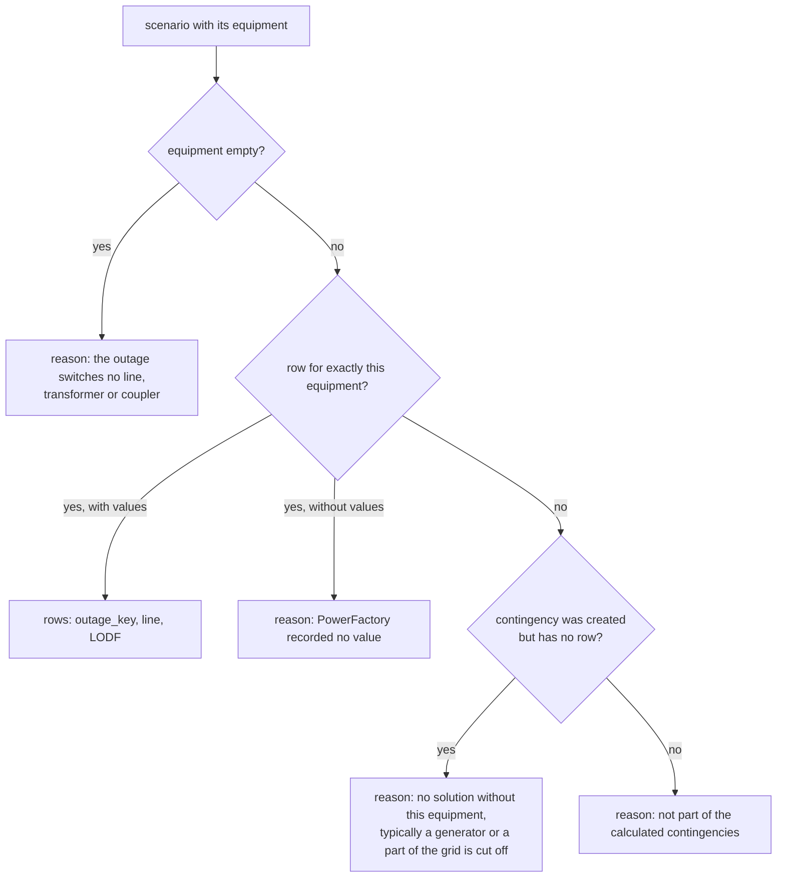
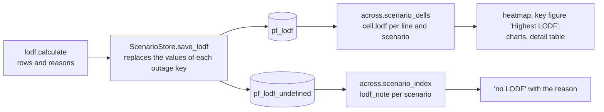

# LODF: how it is calculated

The line outage distribution factors (LODF) are **not calculated by this project**. PowerFactory's own tool
*Sensitivities / Distribution Factors* (`ComVstab`) calculates them. `powerfactory/lodf.py` sets that tool up in the
active Study Case, runs it once, reads its result file and hands the numbers to the database. This page describes
every step, with the code that does it.

Status of the verification (state of 2026-10-05):

| Part | Verified how |
|---|---|
| Stage 1-3 below (outages -> contingencies -> `ComVstab` -> result file) | `powerfactory/lodf_probe.py`, version 5, in PowerFactory: 2 outages, 2 of 2 with a LODF, 24 lines each |
| The same steps inside the assessment (`start_assessment.py`, step 4/5) | unit tests against a PowerFactory fake (`backend/tests/test_lodf.py`); **not yet run end to end in PowerFactory** |

## 1. What a LODF is, and what is stored

For an outaged line *k* and a monitored line *m*:

```
LODF(k -> m) = change of the flow on m caused by the outage of k  /  flow on k before the outage
```

PowerFactory writes it in percent (73.6 %); the script stores the **signed fraction** (0.736) at the `bus1` side of
the monitored line. The dashboard shows |LODF| and calls a value of 0.3 or more notable
(`frontend/src/config/loadingBands.ts`, `lodfNotable`).

Result rows in the database (`pf_lodf`): `outage_key`, `element_id` (the monitored line), `lodf`, `p_pre` and
`p_post` (always empty: PowerFactory gives no flows here), `computed_at`. Outages without LODF are stored with their
reason in `pf_lodf_undefined`.

## 2. Overview



The LODF depends only on the topology, so it is calculated **once before the first scenario simulation** and not per
QDS run. It uses the load flow of the Study Case (AC), not a DC approximation.

## 3. Step by step

### 3.1 Which equipment an outage switches off

`analysis_worker.compute_lodf` groups the scenarios of the plan by `outage_key` (the sorted outage ids joined by `,`),
so scenarios with the same outages share one calculation. For each group the equipment is read from the planned
outages (`IntPlannedout` / `IntOutage`): the outage object and its children are searched for the attributes that
hold the switched equipment (`components`, `p_target`, ...), and only branches are kept.

```python
BRANCH_CLASSES = ("ElmLne", "ElmTr2", "ElmTr3", "ElmCoup")

def outage_equipment(outage):
    """Branches a planned outage switches off (the outage object and its actions)."""
    related = []
    holders = [outage]
    try:
        holders += list(outage.GetContents("*", 1) or [])
    except Exception:
        pass
    for holder in holders:
        for attribute in engine.OUTAGE_EQUIPMENT_ATTRIBUTES:
            related.extend(engine._as_objects(engine.safe_attr(holder, attribute)))
    unique = {}
    for item in related:
        if engine.class_name(item) in BRANCH_CLASSES:
            unique[engine.object_key(item)] = item
    return list(unique.values())
```

An outage that switches no branch (for example a demand transfer or a busbar) gets no contingency and therefore
no LODF; the reason is stored.

### 3.2 Contingency objects

PowerFactory calculates the LODF per **contingency** (`ComOutage`) of a Contingency Analysis (`ComSimoutage`).
The script does not touch the Contingency Analysis of the user. It creates its own, named `Outage Assessment`
(emptied and refilled when it exists from an earlier run), with **one `ComOutage` per distinct equipment**,
filled with `SetObjs` and checked by reading the table back (`GetObject`):

```python
analysis = _create(study_case, "ComSimoutage", ANALYSIS_NAME)     # or ClearCont() on the existing one
for keys, scenario in wanted.items():
    contingency = _create(analysis, "ComOutage", scenario.get("name") or scenario["key"])
    code = contingency.SetObjs(list(scenario["equipment"]))
    if engine.finite_number(code) not in (0, None) or contingency_keys(contingency) != keys:
        raise LodfError("Contingency '{}' does not list its equipment ...".format(name))
```

A combined outage (several planned outages in one scenario) is **one contingency with all its equipment**; its
LODF is the effect of switching all of them off together.

### 3.3 The command and its settings

The command is the `ComVstab` of the Study Case; when there is none, `app.GetFromStudyCase("ComVstab")` creates it.
For the run it needs the link to the own analysis and three settings. All are put back afterwards.

| Attribute | Value | Why |
|---|---|---|
| `pComSimoutage` | the own analysis | "Consider contingencies: Contingency Analysis" |
| `isContSens` | 1 | "Consider contingencies". **Without it PowerFactory stops with "Please enable at least one sensitivity factor", even with `calcLodf` on.** Not present in every PowerFactory version, then it is skipped |
| `calcLodf` | 1 | "Sensitivities / Distribution factors: Line Outage Distribution Factors" |
| `lodflim` | 0 | "Min. Line Outage Distribution Factors" in %: values below it are **not written** to the result file; 0 records everything |

```python
RUN_SETTINGS = (("isContSens", 1), ("calcLodf", 1), ("lodflim", RECORD_ALL))   # RECORD_ALL = 0

def _execute(distribution):
    with StateGuard() as guard:                          # restores every setting and verifies it
        for attribute, _value, outcome in set_run_settings(guard, distribution):
            if outcome == "CANNOT BE READ OR WRITTEN":
                raise LodfError("ComVstab.{} cannot be read or written; LODF was not calculated.".format(attribute))
        code = distribution.Execute()
        if engine.finite_number(code) not in (0, None):
            raise LodfError("'Sensitivities / Distribution Factors' ended with error code " + str(code) + ".")
        result = lodf_result(distribution)
        return read_matrix(result)
```

`StateGuard` (`powerfactory/pf_state.py`) records the original value before every write and checks it after the
restore; a setting that cannot be restored raises `StateRestoreError` with the value that was expected and the one
found, so the Study Case can be checked by hand.

### 3.4 What PowerFactory does while it runs

From the output window of a real run (two contingencies):

```
Calculating sensitivities / distribution factors...
Initial load flow calculation OK.
Updating 2 Contingencies...
Calculating Contingencies with Load Flow Method (optimised)...
Calculating contingency '   NE_L1'...   ... converged successfully in 3 outer loop(s) ...
Calculating contingency '   NE_L2'...   ... converged successfully in 3 outer loop(s) ...
Load Flow Method (optimised): 2 out of 2 contingencies calculated.
Calculation of sensitivities / distribution factors successfully completed.
```

A load flow of the intact grid, then one load flow per contingency. A contingency that does not converge has **no
row** in the result file (see 3.6).

### 3.5 The result file

`ComVstab.pResult` is a folder (`Distribution Factors Results (SYM)`; empty until the first successful run). Its
child whose name ends with `_LODF` is an `ElmRes`:

| Column (variable) | Meaning |
|---|---|
| `b:outid` | negative number per row; `ElmRes.GetObj(outid)` is the contingency (`ComOutage`) of that row |
| `m:LODF:bus1` / `m:LODF:bus2` | LODF of one line in %, at its bus1 / bus2 side (opposite sign, equal up to losses); the object of the column is the line |

One row per contingency that has a solution. `GetValue` returns `(error code, value)`; a value below `lodflim` comes
back with code 3 ("not written") and is skipped. The script uses the **bus1** side:

```python
def read_matrix(result):          # shortened: the real function also handles errors and releases the file
    """[(contingency, {line key: (line, LODF as fraction)})] for every calculated contingency."""
    result.Load()
    rows, columns = int(result.GetNumberOfRows()), int(result.GetNumberOfColumns())
    for column in range(columns):
        variable = str(result.GetVariable(column))
        if variable == OUTAGE_ID_VARIABLE:        # "b:outid"
            outid_column = column
        elif variable == LODF_VARIABLE:           # "m:LODF:bus1"
            lines[column] = result.GetObject(column)
    for row in range(rows):
        outid = engine.result_value(result, row, outid_column)
        contingency = result.GetObj(int(outid))
        for column, line in lines.items():
            value = engine.result_value(result, row, column)    # None: not written
            if value is not None:
                values[engine.object_key(line)] = (line, value / 100.0)
```

Which equipment a row belongs to is read from the contingency itself (`ComOutage.GetObject(i)` lists its
equipment), never from its name or position:

```python
solved[contingency_keys(contingency)] = values      # frozenset of the equipment keys -> {line: (line, lodf)}
```

### 3.6 From the rows to the scenarios

Each scenario is matched with the row whose contingency has **exactly its equipment**:



```python
for scenario in scenarios:
    wanted = frozenset(engine.object_key(b) for b in scenario["equipment"])
    if not wanted:
        reason = "LODF '...': the outage switches no line, transformer or coupler; no LODF."
    elif wanted in solved and solved[wanted]:
        rows.extend((scenario["key"], element_id(line), value, None, None)
                    for line, value in solved[wanted].values())
        continue
    elif wanted in defined:
        reason = "... PowerFactory's contingency analysis found no solution without ...; not defined"
    ...
    undefined[scenario["key"]] = reason
```

`element_id(line)` is the same hash of the project path and the PowerFactory path that identifies the line in the
results (`analysis_worker.identifier`), so a LODF value and the loading of that line meet in the dashboard.

### 3.7 After the calculation

The original `pComSimoutage` link, `isContSens`, `calcLodf` and `lodflim` are back to what they were. What the run
created (the Contingency Analysis `Outage Assessment` with its contingencies, and a `ComVstab` if there was none)
**stays in the Study Case** so that it can be opened; `CLEAN_UP = True` in `lodf.py` deletes it.

## 4. Storage and use in the dashboard



- `save_lodf` deletes the earlier values and reasons of every outage key it writes, so a reason never sits next
  to old values.
- A summary that the script prepared for a scenario (`pf_scenario_cells`) is valid only for the LODF it was made
  with (`lodf_stamp`); after a new LODF run the dashboard reduces the scenario again.
- The dashboard shows |LODF|. The sign (direction of the flow change) stays in the database and in the view
  `v_lodf`.

## 5. Limits

- **Lines only** are monitored: the result has columns for `ElmLne`. Transformers and couplers as monitored
  equipment show "not calculated". They can be switched off (outaged) as equipment.
- Values are at the **bus1** side of the line.
- A contingency without solution has no LODF. The other outages are not affected.
- `p_pre` / `p_post` are empty; PowerFactory's result file holds no flows for this tool.
- Only what has a contingency is calculated: scenarios outside the simulated period are skipped before the LODF
  step.

## 6. Messages and what to do

| Message | Cause | What to do |
|---|---|---|
| `Please enable at least one sensitivity factor for calculation or modal analysis` | `isContSens` ("Consider contingencies") was off | handled by `RUN_SETTINGS`; if it appears again, run the probe and look at the attribute table |
| `... ended with error code 1` | the command failed; the reason is in the PowerFactory output just above | read those lines |
| `left no result file ending with '_LODF' in ComVstab.pResult` | the command ran but wrote no LODF (no factor enabled, no contingency) | run the probe: it lists what `pResult` contains |
| `ComVstab.<attribute> cannot be read or written` | read-only project or another PowerFactory version | check the attribute in the probe table |
| `PowerFactory could not create '...ComOutage' / '...ComSimoutage'` | the Study Case cannot be changed | write access to the project |
| `... could not be restored` (`StateRestoreError`) | a setting could not be put back | the message names the setting and both values; fix by hand in the Study Case |
| `outage ... is not part of the calculated contingencies` | internal: a scenario has equipment but no contingency | report with the output |

A failure of the LODF step is a **warning**, not an abort: the scenarios are still calculated and the dashboard shows
"no LODF" with the reason (`lodfStatus` in `frontend/src/util/lodfStatus.ts`).

## 7. Testing the LODF on its own

`powerfactory/lodf_probe.py` is one self-contained file (no other project file needed) that runs the three stages
and stops at the first that fails; its output starts with `LODF PROBE · version N`, so one can see which copy ran.
Run it as an external ComPython script in the active Study Case.

| Stage | What it does | What it prints |
|---|---|---|
| 1 | loads the planned outages and their branches | table of outages; the first outage without a branch is explained |
| 2 | creates the Contingency Analysis `LODF Probe` with one `ComOutage` per chosen outage | requested equipment and what `GetObject` reads back |
| 3 | sets `pComSimoutage`, `isContSens`, `calcLodf`, `lodflim`, executes `ComVstab`, reads `_LODF` | all 52 attributes of the command with value and description, the return code, the largest LODF per outage |

Settings at the top of the file: `OUTAGES` / `MAX_OUTAGES` (which outages), `EXTRA_SETTINGS` (more `ComVstab`
attributes to set for the run), `CLEAN_UP`. Unit tests: `backend/tests/test_lodf.py` (production code) and
`backend/tests/test_lodf_probe.py` (probe), both against a fake of the PowerFactory API.
